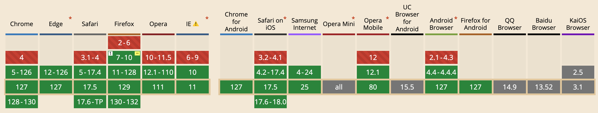

## JuggleIM Web SDK

一个高性能，可扩展的开源 IM 即时通讯系统。

### 社群讨论

如果对 IM 感兴趣、有集成问题讨论的朋友，非常欢迎加入社群讨论～

[Telegram 中文群](https://t.me/juggleim_zh)、[Telegram English](https://t.me/juggleim_en)、[添加好友加入微信群](https://downloads.juggle.im/xiaoshan.jpg)

_备注：由于微信群二维码有时间限制，加入微信讨论可优先加 **小山** 微信好友，由 Ta 邀请进群组_

### 项目介绍

JuggleIM 官方开源的 Web IM SDK 源码，提供 IM 即时通讯功能，包含 IM 基础连接、重连、单聊、群聊、直播聊天室等功能模块，支持发送文本、图片、文件或自定义等多种消息类型。

通常情况下，开发者可根据官方文档集成使用：[https://www.juggle.im/](https://www.juggle.im/)

### 源码编译

> 1、编译环境要求 node.js `16.20+`

> 2、安装依赖包，项目根目录执行 `npm install`

> 3、编译可引入 SDK，项目根目录执行 `npm run release`

> 4、`dist` 目录选择环境所需 `SDK` 文件拷贝至项目中使用

### 浏览器兼容性

